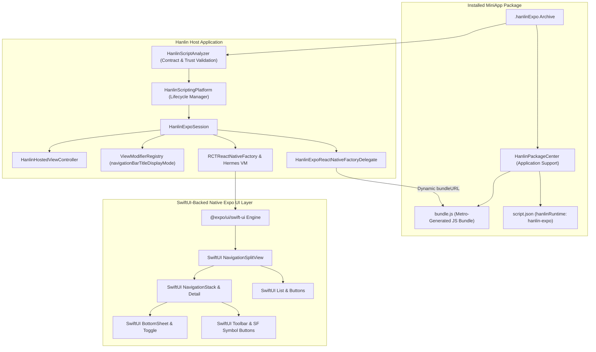

# Hanlin Expo / React Native SwiftUI Dynamic Runtime Guide

This document specifies the architecture, operational contracts, performance metrics, and development guidelines for the **Hanlin Expo / React Native SwiftUI Runtime** (`hanlinExpo`), enabling dynamically installed MiniApps (`.hanlinExpo`) to render Apple SwiftUI components using Expo UI (`@expo/ui/swift-ui`) and Hermes on iOS 26+.

---

## 1. Architectural Overview & Mental Model

Hanlin AI features a multi-engine runtime platform capable of hosting isolated MiniApps across multiple paradigms:
* **`scriptingJSC`**: Embedded JavaScriptCore runtime with declarative reactive primitives (`HanlinScriptUI`).
* **`hanlinNativeScript`**: NativeScript 9.1 runtime with direct Objective-C runtime metadata reflection and Core UI.
* **`hanlinExpo`**: Dynamic React Native 0.88 / Expo SDK 58 runtime executing on Hermes VM, with native declarative UI components backed by Apple's SwiftUI via Expo UI.



### Key Architectural Invariants:
1. **No Host Recompilation for Installed Bridge Capabilities**: The host app (`AI_Hanlin`) does not compile MiniApp JavaScript into its binary. The JS bundle is resolved dynamically from the installed package directory. Adding a new native SwiftUI bridge capability or regenerating for a new Apple SDK requires one host build; MiniApps using the capability surface already installed in that host do not.
2. **Dynamic Package / Session Switching**: Swapping from MiniApp A to MiniApp B instantiates an isolated `HanlinExpoSession` pointing to the selected package's bundle path; the host application remains alive without recompilation.
3. **SwiftUI-Backed Components via Expo UI**: The `@expo/ui/swift-ui` components tested in the probe (including `NavigationSplitView`, `NavigationStack`, `List`, `Toolbar`, `Button`, `Toggle`, and `BottomSheet`) are backed by genuine Apple SwiftUI view structs and modifiers. React Native, Hermes, and Expo UI provide the underlying runtime host, event bridging, and state management.
4. **Session Teardown Lifecycle**: Dismissing an active Expo MiniApp triggers explicit teardown in `HanlinExpoSession.shutdown()`, removing the hosted view, clearing `reactHost` references, releasing factory/delegate resources, destroying the Expo app context, and unregistering custom modifiers.

### Generated SwiftUI capability pipeline

The production bridge follows one reproducible path:

```text
stable Xcode iPhoneOS SwiftUI + SwiftUICore interfaces
  -> SwiftSyntax inventory and per-overload classification
  -> generated native SwiftUI wrappers + typed TypeScript
  -> @hanlin/expo-ui
  -> dynamic TSX MiniApp
  -> real SwiftUI views in the prebuilt Hanlin host
```

The complete SDK interfaces are exported through the generic `apple-sdk-interface` command in
`apple-devtools`; they are local generation inputs and are not committed. The checked-in coverage
records their hashes and toolchain identity. Expo symbol presence, reviewed Expo semantic coverage,
generated adapters, and manual adapters are reported separately, and partial overload support is not
reported as full symbol support. See `Tools/SwiftUIBridge/README.md` for regeneration details.

---

## 2. Dynamic Bundle Loading & Host Integration

### 2.1 The Dynamic Factory Delegate

In standard Expo/React Native brownfield setups, `bundleURL()` typically points to a resource bundled inside `Bundle.main`. In Hanlin, `HanlinExpoReactNativeFactoryDelegate` dynamically provides the installed package bundle URL:

```swift
final class HanlinExpoReactNativeFactoryDelegate: ExpoReactNativeFactoryDelegate {
    private let appBundleURL: URL

    init(bundleURL: URL, appContext: AppContext) {
        self.appBundleURL = bundleURL
        super.init(appContext: appContext)
    }

    override func sourceURL(for bridge: RCTBridge) -> URL? {
        return appBundleURL
    }

    override func bundleURL() -> URL? {
        return appBundleURL
    }
}
```

### 2.2 Session Lifecycle (`HanlinExpoSession`)

`HanlinExpoSession` manages the isolated runtime instance:
* **Initialization**: Registers custom SwiftUI modifiers with `ViewModifierRegistry`, sets up `RCTReactNativeFactory`, and creates the root view via `rootViewFactory.view(withModuleName:initialProperties:launchOptions:)`.
* **Container Hosting**: Embeds the root view into a `UIViewController` container ready for `HanlinHostedViewController` presentation.
* **Teardown (`shutdown`)**:
  - Removes the hosted root view from its superview (`hostedView?.removeFromSuperview()`).
  - Clears `reactHost` on `rootViewFactory` (`rootViewFactory.reactHost = nil` and `rootViewFactory.setValue(nil, forKey: "_reactHost")`).
  - Releases factory and delegate references (`reactNativeFactory = nil`, `factoryDelegate = nil`).
  - Destroys the Expo `AppContext` (`appContext?.destroy()`).
  - Unregisters custom modifiers (`HanlinExpoModifierRegistry.unregisterCustomModifiers()`).
  - Clears the active session singleton reference.

---

## 3. Extensible SwiftUI Modifiers (`HanlinExpoModifierRegistry`)

Expo UI supports registering custom Swift modifier factories using its public `ViewModifierRegistry`. Hanlin implements the `navigationBarTitleDisplayMode` modifier:

### Swift Implementation:
```swift
import ExpoUI
import SwiftUI

public enum HanlinExpoModifierRegistry {
    public static func registerCustomModifiers() {
        ViewModifierRegistry.register("navigationBarTitleDisplayMode") { (params: [String: Any]) in
            let modeString = params["displayMode"] as? String ?? "inline"
            let displayMode: NavigationBarItem.TitleDisplayMode = switch modeString {
            case "large": .large
            case "automatic": .automatic
            default: .inline
            }
            return AnyViewModifier { content in
                content.navigationBarTitleDisplayMode(displayMode)
            }
        }
    }

    public static func unregisterCustomModifiers() {
        ViewModifierRegistry.unregister("navigationBarTitleDisplayMode")
    }
}
```

### TypeScript Usage:
```typescript
import { createModifier } from '@expo/ui/swift-ui/modifiers';

export const navigationBarTitleDisplayMode = (mode: 'inline' | 'large' | 'automatic' = 'inline') =>
  createModifier('navigationBarTitleDisplayMode', { displayMode: mode });

// Applied in JSX:
<NavigationSplitView modifiers={[navigationBarTitleDisplayMode('inline')]}>
  ...
</NavigationSplitView>
```

---

## 4. Package Contract & Specification (`.hanlinExpo`)

A `.hanlinExpo` package is a standard ZIP archive containing:
* `script.json`: Root package manifest.
* `package.json`: Component metadata and dependency specifications.
* `bundle.js`: Complete, self-contained CommonJS JavaScript bundle generated by Metro (`npx react-native bundle`).
* `assets/`: Optional static media (icons, Torah texts, audio).

### Example `script.json`:
```json
{
  "name": "Expo SwiftUI Probe A",
  "version": "1.0.0",
  "description": "Dynamic Expo / React Native SwiftUI MiniApp for Hanlin",
  "entry": "bundle.js",
  "runInApp": true,
  "hanlinRuntime": "hanlin-expo"
}
```

### Example `package.json`:
```json
{
  "name": "expo-swiftui-probe-a",
  "version": "1.0.0",
  "private": true,
  "dependencies": {
    "@expo/ui": "58.0.3",
    "expo-brownfield": "58.0.3",
    "expo-modules-core": "58.0.3",
    "react": "19.2.3",
    "react-native": "0.88.0-rc.0"
  },
  "hanlinExpo": {
    "runtimeVersion": "58.0.3",
    "reactNativeVersion": "0.88.0"
  }
}
```

---

## 5. Technical Metrics & Section 27 Overhead

### 5.1 Binary Size Impact Breakdown

The host integration embeds prebuilt binary XCFrameworks into `HanlinExpoRuntime`:

| XCFramework | Fat Universal Archive | Device Slice (`ios-arm64`) |
|:---|:---:|:---:|
| `ExpoUI.xcframework` | 104.60 MB | 34.70 MB |
| `ExpoModulesCore.xcframework` | 75.20 MB | 24.97 MB |
| `hermesvm.xcframework` | 66.83 MB | 6.04 MB |
| `React.xcframework` | 112.54 MB | 12.26 MB |
| `ReactNativeDependencies.xcframework` | 44.75 MB | 1.19 MB |
| `ExpoBrownfield.xcframework` | 2.68 MB | 0.89 MB |
| `ExpoModulesWorklets.xcframework` | 2.76 MB | 0.92 MB |
| **Total Overhead (Uncompressed)** | **409.36 MB** | **80.97 MB** |

> [!NOTE]
> Fat universal archives contain multi-platform and simulator slices (`ios-arm64_x86_64-simulator`, `maccatalyst`, `tvos`, `xros`). When archiving for device, Xcode bundles only the target architecture slice (`ios-arm64`, totalling 80.97 MB uncompressed). Actual compressed App Store / TestFlight download and install sizes are reported by App Store Connect after processing the build archive.

### 5.2 Runtime Performance & Validation Status

Physical-device memory, FPS, and startup-latency benchmarks have not yet been collected.

Prior spike closure verification (run `35473839956` on the isolated spike branch) verified isolated functionality. For the unified product baseline on `codex/integrate-expo-runtime` (and subsequently `codex/translation-widget-miniapps`), automated CI verification runs via `.github/workflows/validate-expo-runtime-spike.yml` on an iPad mini (A17 Pro) iOS 26.5 Simulator (Xcode 26.6, macOS 26 runner). This suite verifies end-to-end package resolution, dynamic bundle loading, SwiftUI view hierarchy composition, SF Symbol toolbar interaction, bottom sheet presentation, toggle state mutation, dynamic package switching, and clean relaunch without host recompilation.

---

## 6. Detailed Comparison: Expo SwiftUI vs. NativeScript Core

| Dimension | Hanlin Expo Runtime (`hanlinExpo`) | Hanlin NativeScript (`hanlinNativeScript`) |
|:---|:---|:---|
| **JS Virtual Machine** | **Hermes VM** (Meta, optimized for low memory & fast startup) | **JavaScriptCore** / V8 (WebKit native bridge) |
| **Bridge Mechanism** | **JSI (JavaScript Interface)** & C++ TurboModules | **Direct Objective-C Runtime Metadata Reflection** |
| **UI Paradigm** | **SwiftUI-backed components** via `@expo/ui/swift-ui` in React Native host | **NativeScript Core UI** (`Page`, `Frame`) + Pre-embedded SwiftUI Providers |
| **Layout Engine** | Native SwiftUI Layout (containers: `NavigationSplitView`, `VStack`, `HStack`) | Flexbox Layout (Yoga / NativeScript layout engine) |
| **Modifier Architecture** | Dynamic registry (`ViewModifierRegistry`) | Pre-compiled Swift Fixture Providers (`UIDataDriver`) |
| **MiniApp Package Size** | **~266.7 KB** (current generated probe fixture size; full Metro JS bundle) | 12 KB – 45 KB (depends on core modules bundled) |
| **Threading Model** | Multi-threaded (JS thread + Shadow thread + Main UI) | Single-threaded Main Loop (JS runs directly on main/worker) |
| **Package Switching** | Dynamic package/session switching (isolated session per package bundle path) | Context recreation / isolate reload |
| **Platform Fidelity** | **SwiftUI-backed native views** for supported components (`NavigationSplitView`, `Toolbar`, `BottomSheet`, `Toggle`) via Expo UI | Direct UIKit views + wrapper-hosted SwiftUI |

> [!NOTE]
> In baseline testing, NativeScript verification was confirmed specifically by passing `HanlinNativeScriptProductionE2ETests/testProductionSwiftUIInteractionCoreRegressionAndLifecycle`.

---

## 7. Developer Guide: Creating an Expo SwiftUI MiniApp

### 7.1 Directory Layout
```
MyMiniApp/
├── script.json         # Hanlin manifest
├── package.json        # Dependencies declaration
├── App.tsx             # Root SwiftUI component tree
└── index.ts            # Entrypoint registering App with AppRegistry
```

### 7.2 Entrypoint Registration (`index.ts`)
```typescript
import { AppRegistry } from 'react-native';
import App from './App';

AppRegistry.registerComponent('ExpoSwiftUIProbe', () => App);
```

### 7.3 Building & Packaging
Run `build-probe.mjs` to produce standalone `.hanlinExpo` packages using Metro:
```bash
node Scripts/Expo/build-probe.mjs
```
The resulting `.hanlinExpo` archive can be directly imported via the **Add Apps** sheet or staged into the test simulator environment.
