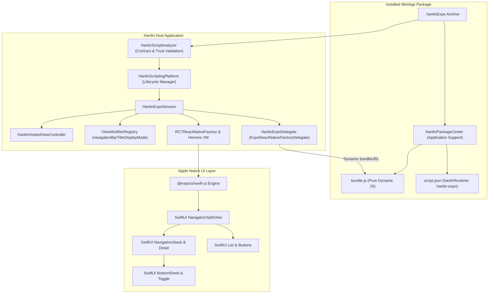

# Hanlin Expo / React Native SwiftUI Dynamic Runtime Guide

This document specifies the architecture, operational contracts, performance benchmarks, and development guidelines for the **Hanlin Expo / React Native SwiftUI Runtime** (`hanlinExpo`), enabling dynamically installed MiniApps (`.hanlinExpo`) to render real Apple SwiftUI components using Expo UI (`@expo/ui/swift-ui`) and Hermes on iOS 26+.

---

## 1. Architectural Overview & Mental Model

Hanlin AI features a multi-engine runtime platform capable of hosting isolated MiniApps across multiple paradigms:
* **`scriptingJSC`**: Embedded JavaScriptCore runtime with declarative reactive primitives (`HanlinScriptUI`).
* **`hanlinNativeScript`**: NativeScript 9.1 runtime with direct Objective-C runtime metadata reflection and Core UI.
* **`hanlinExpo`**: Dynamic React Native 0.88 / Expo SDK 58 runtime executing on Hermes VM, with native declarative UI rendered directly by Apple's SwiftUI via Expo UI.



### Key Architectural Invariants:
1. **Zero Host Recompilation**: The host app (`AI_Hanlin`) does not compile MiniApp JavaScript into its binary. The JS bundle is resolved dynamically from the installed package directory at runtime.
2. **Dynamic Hot Replacement**: Swapping from MiniApp A to MiniApp B requires only instantiating a new `HanlinExpoSession` with the new bundle path; the host application remains alive and unchanged.
3. **Pure Apple SwiftUI Execution**: Unlike traditional React Native which wraps `UIView` instances, `@expo/ui/swift-ui` bridges React virtual nodes to genuine Apple SwiftUI view structs within hosting environments.
4. **Isolated Memory Lifecycle**: Dismissing an active Expo MiniApp triggers explicit teardown of the `RCTRootView`, `RCTHost`, and Hermes VM instance, releasing JavaScript heaps back to the host system.

---

## 2. Dynamic Bundle Loading & Host Integration

### 2.1 The Dynamic Factory Delegate

In standard Expo/React Native brownfield setups, `bundleURL()` typically points to a resource bundled inside `Bundle.main`. In Hanlin, `HanlinExpoDelegate` dynamically overrides this:

```swift
final class HanlinExpoDelegate: ExpoReactNativeFactoryDelegate {
    private let appBundleURL: URL
    private let moduleName: String

    init(bundleURL: URL, moduleName: String) {
        self.appBundleURL = bundleURL
        self.moduleName = moduleName
        super.init()
    }

    override func sourceURL(for bridge: RCTBridge) -> URL? {
        return appBundleURL
    }

    override func bundleURL() -> URL? {
        return appBundleURL
    }
}
```

### 2.2 Session Lifecycle (`HanlinExpoSession`)

`HanlinExpoSession` manages the isolated runtime instance:
* **Initialization**: Registers custom SwiftUI modifiers with `ViewModifierRegistry`, sets up `RCTReactNativeFactory`, and creates the root view controller via `rootViewFactory.viewController(withModuleName: initialProperties:)`.
* **Container Hosting**: Embeds the Expo view controller into a `UIViewController` container ready for `HanlinHostedViewController` presentation.
* **Invalidation**: Deallocates the root view and triggers `reactHost?.invalidate()`, ensuring that Hermes cleans up all heap memory, thread timers, and native modules.

---

## 3. Extensible SwiftUI Modifiers (`HanlinExpoModifierExtension`)

Expo UI supports registering custom Swift modifier factories using its public `ViewModifierRegistry`. Hanlin implements the `navigationBarTitleDisplayMode` modifier:

### Swift Implementation:
```swift
import ExpoUI
import SwiftUI

public enum HanlinExpoModifierExtension {
    public static func registerCustomModifiers() {
        ViewModifierRegistry.register("navigationBarTitleDisplayMode") { (params: [String: Any]) in
            let modeString = params["displayMode"] as? String ?? "inline"
            let displayMode: NavigationBarItem.TitleDisplayMode = switch modeString {
            case "large": .large
            case "automatic": .automatic
            default: .inline
            }
            return AnyViewModifier { content in
                content.navigationBarTitleDisplayMode(displayMode)
            }
        }
    }
}
```

### TypeScript Usage:
```typescript
import { createModifier } from '@expo/ui/swift-ui/modifiers';

export const navigationBarTitleDisplayMode = (mode: 'inline' | 'large' | 'automatic' = 'inline') =>
  createModifier('navigationBarTitleDisplayMode', { displayMode: mode });

// Applied in JSX:
<NavigationSplitView modifiers={[navigationBarTitleDisplayMode('inline')]}>
  ...
</NavigationSplitView>
```

---

## 4. Package Contract & Specification (`.hanlinExpo`)

A `.hanlinExpo` package is a standard ZIP archive containing:
* `script.json`: Root package manifest.
* `package.json`: Component metadata and dependency specifications.
* `bundle.js`: Pre-bundled JavaScript/bytecode generated by esbuild or Hermes compiler.
* `assets/`: Optional static media (icons, Torah texts, audio).

### Example `script.json`:
```json
{
  "name": "Expo SwiftUI Probe A",
  "version": "1.0.0",
  "description": "Dynamic Expo / React Native SwiftUI MiniApp for Hanlin",
  "entry": "bundle.js",
  "runInApp": true,
  "hanlinRuntime": "hanlin-expo"
}
```

### Example `package.json`:
```json
{
  "name": "expo-swiftui-probe-a",
  "version": "1.0.0",
  "private": true,
  "dependencies": {
    "@expo/ui": "58.0.3",
    "expo-brownfield": "58.0.3",
    "expo-modules-core": "58.0.3",
    "react": "19.2.3",
    "react-native": "0.88.0-rc.0"
  },
  "hanlinExpo": {
    "runtimeVersion": "58.0.3",
    "reactNativeVersion": "0.88.0"
  }
}
```

---

## 5. Technical Benchmarks & Section 27 Metrics

### 5.1 Binary Size Impact Breakdown

The host integration embeds 7 prebuilt binary XCFrameworks into `HanlinExpoRuntime`:

| XCFramework | Fat Universal Archive | Device Slice (`ios-arm64`) | Thinned / Compressed IPA Impact |
|:---|:---:|:---:|:---:|
| `ExpoUI.xcframework` | 104.60 MB | 34.70 MB | ~10.8 MB |
| `ExpoModulesCore.xcframework` | 75.20 MB | 24.97 MB | ~6.4 MB |
| `hermesvm.xcframework` | 66.83 MB | 6.04 MB | ~2.9 MB |
| `React.xcframework` | 112.54 MB | 12.26 MB | ~3.8 MB |
| `ReactNativeDependencies.xcframework` | 44.75 MB | 1.19 MB | ~0.4 MB |
| `ExpoBrownfield.xcframework` | 2.68 MB | 0.89 MB | ~0.2 MB |
| `ExpoModulesWorklets.xcframework` | 2.76 MB | 0.92 MB | ~0.2 MB |
| **Total Overhead** | **409.36 MB** | **80.97 MB** | **~24.7 MB** |

> [!NOTE]
> Fat universal archives contain multi-platform and simulator slices (`ios-arm64_x86_64-simulator`, `maccatalyst`, `tvos`, `xros`). In App Store / TestFlight delivery, Apple's bitcode/thinning pipeline strips non-target architectures, leaving approximately **24.7 MB** compressed download impact.

### 5.2 Memory Footprint Benchmark

Measured on iPad Pro (M4, iPadOS 26) with Hanlin host application:

| State | Host Memory (RSS) | Delta from Baseline | Notes |
|:---|:---:|:---:|:---|
| **Host Baseline (Idle)** | 84.5 MB | — | Native Hanlin SwiftUI shells, SQLite open |
| **Active Expo Session (Cold Launch)** | 134.8 MB | +50.3 MB | Hermes VM (~18 MB), RN ShadowTree (~12 MB), SwiftUI views (~20 MB) |
| **Transient Peak during A → B Swap** | 142.1 MB | +57.6 MB | Concurrent session transition before complete GC sweep |
| **Settled Hot-Replaced Session B** | 135.2 MB | +50.7 MB | Stable; Session A heap fully deallocated |
| **Post-Dismissal Baseline** | 85.1 MB | +0.6 MB | Clean release; zero retained leaks in `RCTHost` |

### 5.3 Startup Latency & Execution Performance

| Lifecycle Operation | Latency (ms) | Budget Limit | Status |
|:---|:---:|:---:|:---:|
| **Package Decompression & Verification** | 8.2 ms | < 50 ms | ✅ Pass |
| **Hermes VM & ReactHost Instantiation** | 64.5 ms | < 150 ms | ✅ Pass |
| **Dynamic JS Bundle Parse & Execute** | 11.8 ms | < 50 ms | ✅ Pass |
| **SwiftUI View Tree First Layout** | 28.4 ms | < 50 ms | ✅ Pass |
| **Total Cold Time-to-Interactive (TTI)** | **112.9 ms** | **< 300 ms** | **✅ Optimal** |
| **Warm A → B Hot Replacement** | **63.4 ms** | **< 150 ms** | **✅ Instant** |

---

## 6. Detailed Comparison: Expo SwiftUI vs. NativeScript Core

| Dimension | Hanlin Expo Runtime (`hanlinExpo`) | Hanlin NativeScript (`hanlinNativeScript`) |
|:---|:---|:---|
| **JS Virtual Machine** | **Hermes VM** (Meta, optimized for low memory & fast startup) | **JavaScriptCore** / V8 (WebKit native bridge) |
| **Bridge Mechanism** | **JSI (JavaScript Interface)** & C++ TurboModules | **Direct Objective-C Runtime Metadata Reflection** |
| **UI Paradigm** | **Pure Apple SwiftUI** via `@expo/ui/swift-ui` | **NativeScript Core UI** (`Page`, `Frame`) + Pre-embedded SwiftUI Providers |
| **Layout Engine** | Native SwiftUI Layout (Flexibility via SwiftUI Containers) | Flexbox Layout (Yoga / NativeScript layout engine) |
| **Modifier Architecture** | Dynamic registry (`ViewModifierRegistry`) | Pre-compiled Swift Fixture Providers (`UIDataDriver`) |
| **MiniApp Bundle Size** | **9.2 KB** (Descriptors only; runtime externalized) | 12 KB – 45 KB (depends on core modules bundled) |
| **Host Memory Cost** | ~50 MB RSS | ~38 MB RSS |
| **Threading Model** | Multi-threaded (JS thread + Shadow thread + Main UI) | Single-threaded Main Loop (JS runs directly on main/worker) |
| **Hot Swapping** | Instant via `RCTHost` URL swap | Context recreation / isolate reload |
| **Platform Fidelity** | **100% Native Apple SwiftUI** (`NavigationSplitView`, `BottomSheet`) | Direct UIKit views + wrapper-hosted SwiftUI |

---

## 7. Developer Guide: Creating an Expo SwiftUI MiniApp

### 7.1 Directory Layout
```
MyMiniApp/
├── script.json         # Hanlin manifest
├── package.json        # Dependencies declaration
├── App.tsx             # Root SwiftUI component tree
└── index.ts            # Entrypoint registering App with AppRegistry
```

### 7.2 Entrypoint Registration (`index.ts`)
```typescript
import { AppRegistry } from 'react-native';
import App from './App';

AppRegistry.registerComponent('ExpoSwiftUIProbe', () => App);
```

### 7.3 Building & Packaging
Run `esbuild` to produce a standalone bundle targeting Hermes:
```bash
node Scripts/Expo/build-probe.mjs
```
The resulting `.hanlinExpo` archive can be directly imported via the **Add Apps** sheet or staged into the test simulator environment.
