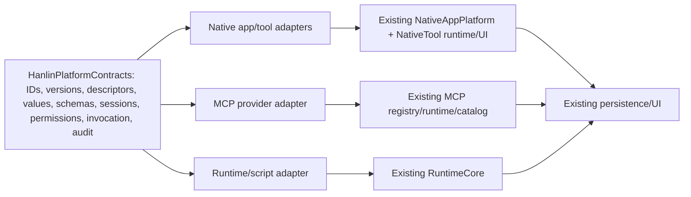

# Hanlin Full Architectural and Contract Audit

Audit snapshot: branch `codex/fix-mcp-reachable-compatibility`, HEAD `da0929110903c83e9314ccd29d14d6d8be987d1a`.

## Executive conclusion

Hanlin already has a strong **Phase 1 contract kernel** in `Packages/HanlinPlatform`, but it is not linked to the application and therefore is not the current runtime source of truth. The live product is composed from several independently evolved contract families: NativeAppPlatform, NativeAgentExtensions, MCP, RuntimeCore, AgentActivity/Diagnostics, the upstream-derived app models/UI, and an authorized but reference-only Scripting surface.

The repository does **not** contain exact duplicate canonical types that can safely be collapsed by renaming or type-aliasing. It contains 18 near-duplicate responsibility groups with important semantic differences, and it lacks 14 canonical contract families needed to connect package/app/session/runtime/permissions/tools/persistence end to end.

The recommended architecture is **Option B: canonical value contracts plus narrow subsystem adapters**, leaving existing executable, UI and persisted models in place until explicit migration decisions and Xcode verification. No Phase 2 implementation is part of this audit.

## Scope and constraints honored

- Read applicable instructions first: the repository root `AGENTS.md` applies; no nested `AGENTS.md` was found.
- Inspected repository structure, Xcode project/scheme/target settings, Swift packages/dependencies, workflows, runtime lock, platform documentation/ADRs, relevant Swift sources, Scripting declarations/examples/generated inventories and local Git history.
- Added only `docs/hanlin-platform/contract-audit/**` and one generic inventory generator under `Scripts/Audit/**`.
- Did not edit application, package, project, workflow, runtime, reference or recovery files.
- Did not build, compile, test, archive, trigger/wait for GitHub Actions, commit or push.
- Did not implement Phase 2 contracts, adapters, migrations or refactors.

## Deliverables

| File | Purpose |
| --- | --- |
| `CONTRACT_AUDIT_REPORT.md` | Conclusions, evidence, options, risks and recommendation. |
| `CONTRACT_INVENTORY.md` | Declaration-by-declaration human-readable inventory. |
| `contract-inventory.json` | Machine-readable inventory with path/line, target, role, persistence/wire hints, consumers/producers and liveness qualification. |
| `CONTRACT_COMPARISON_MATRIX.md` | 35 responsibility comparisons, overlaps, missing contracts and legacy candidates. |
| `CONTRACT_DEPENDENCY_MAP.md` | Build, logical, runtime, tool, package/session, persistence, concurrency and UI graphs. |
| `CONTRACT_DECISION_REGISTER.md` | 12 accepted/recommended/open decisions and Phase 2 gates. |
| `Scripts/Audit/generate_contract_inventory.py` | Deterministic lexical inventory generator; product-neutral and non-mutating outside the audit output directory. |

## Evidence discipline

This report uses five evidence classes:

- **Code proof (C):** readable source/project/workflow data at cited paths and line ranges.
- **Documentation claim (D):** repository README, architecture document or ADR; not promoted to compiler proof.
- **Git history (H):** local commit/branch/remote data.
- **Inference (I):** reasoned conclusion from multiple static facts; explicitly not compiled/runtime verified.
- **Recommendation (R):** proposed future direction, not current behavior and not implementation authorization.

Apple Developer Documentation was not required or consulted for this repository-internal contract audit. No claim about exact current SDK availability/deprecation is based on web documentation. The installed Xcode SDK was not available or invoked; compiler/SDK acceptance remains unverified.

## Repository state and provenance

| Fact | Result | Evidence class |
| --- | --- | --- |
| Branch | `codex/fix-mcp-reachable-compatibility` | H |
| HEAD | `da0929110903c83e9314ccd29d14d6d8be987d1a` | H |
| Remote branch | HEAD matched `origin/codex/fix-mcp-reachable-compatibility` at audit start; no local unpushed commit. | H |
| Initial working tree | One pre-existing untracked file: `recovery-state-before.txt`. It was not read as an audit input or modified. | H/tool-operation log |
| Origin | `https://github.com/davidpovarsky/hanlin-ai.git`; no configured `upstream` remote. | H |
| Relation to `origin/main` | 0 commits behind / 135 commits ahead. | H |
| Upstream lineage | Root README points to `CherryHQ/hanlin-ai`; current repository is therefore treated as downstream-derived, but exact upstream branch/divergence cannot be proven without an upstream remote. | D + I |
| Last documented full IPA | Repository status documentation associates workflow run `30036394400` and commit `2c41b445…` with the last full application IPA closure. Current HEAD differs, so that result cannot verify this audit snapshot. | D + H |

Local history also shows the platform descriptors introduced by `5a9a4f3` (2026-07-23), NativeAppPlatform beginning at `4b17b47` (2026-07-10), and embedded MCP beginning at `6f24264` (2026-07-21). These dates explain independent contract evolution; they do not establish runtime correctness.

## Project and build baseline

### Application

- C: one Xcode app target, `AI_Hanlin`, and shared scheme `AI_HLY`; no Xcode test target was found (`AI_HLY.xcodeproj/project.pbxproj:1-790`, shared scheme).
- C: the filesystem-synchronized `AI_HLY` group compiles Swift sources under that tree, with documented exceptions for README and JavaScript host/test assets.
- C: app target deployment is iOS/iPadOS 26.0, Swift language mode 6.0, with approachable-concurrency build settings (`project.pbxproj:605-684`).
- C: the target declares iPhone and iPad device families. No live watchOS, macOS or visionOS product target was found.
- C: the extension embed phase exists but is empty; there is no app extension target in the current graph.
- C: resolved package products include MCP 0.12.1, SWCompression 4.9.0, swift-log 1.6.2, CoreXLSX, RichTextKit, LaTeXSwiftUI, ZIPFoundation, MarkdownUI, SwiftSoup, LLM and IOSSystemLite, plus bundled Node/Python/JavaScriptCore runtime integration.

### Platform package

- C: `Packages/HanlinPlatform/Package.swift:1-30` uses Swift tools 6.2, Swift language mode 6 and iOS/macOS 26.
- C: it exposes one library product, `HanlinPlatformContracts`, with one corresponding test target.
- C: there is no Xcode project reference or app import for this package. It is package-only and unlinked.

### Automation

- C: the iOS IPA workflow runs manually and on pushes to `main`; dependency update checking is scheduled and manual; runtime bundle build is manual/reusable.
- D: existing implementation status records an earlier Xcode 26.6 / Swift 6.3.3 / iOS SDK 26.5 closure. That is historical evidence for its exact commit only.
- I: repository policy says CI should be manually requested, but the checked-in workflow triggers are not currently all manual-only. This audit reports the mismatch and does not change workflows.

## Inventory coverage and method

The generic generator scanned all repository Swift files outside build products and imported every symbol from the existing generated Scripting declaration inventory.

| Inventory measure | Count |
| --- | ---: |
| Swift files scanned | 305 |
| Swift declarations indexed | 746 |
| Scripting declaration symbols indexed | 2,419 |
| Total records | 3,165 |
| Comparison responsibility pairs/groups | 35 |
| Exact duplicates | 0 |
| Near-duplicate groups | 18 |
| Missing canonical contract families | 14 |
| Qualified unused/dead candidates | 2 |
| Decision-register entries | 12 |

Swift declaration counts by audited subsystem include 110 NativeAppPlatform, 86 MCP, 93 RuntimeCore, 95 AgentActivity, 17 AgentDiagnostics, 44 NativeAgentExtensions, 72 HanlinPlatformContracts, 43 Chat/tool integration, 27 app persistence models and 152 other app/UI declarations. The JSON/Markdown inventory records each declaration's name, kind, location and line range, subsystem, target inclusion, initial role, Codable/Sendable and actor-isolation traits, persistence/wire hints, lexical producer/consumer paths and qualified live status.

### Inventory limitations

The inventory is a lexical index, not SourceKit, a Swift compiler index or a runtime call graph. It can miss extension-driven/framework-discovered use and can over-count nested/private declarations. Therefore:

- “Compiled in AI_Hanlin” means target inclusion, not execution.
- “No external token consumer found” is a review signal, not proof of dead code.
- Scripting declarations are marked reference-only regardless of examples/docs.
- Every substantive liveness/ownership conclusion below was manually checked against call sites and project inclusion.

## Ten most important findings

### 1. The proposed canonical kernel is not live

C: `HanlinPlatformContracts` contains typed identities, versions, descriptors, value/schema types, errors and a script envelope, but no Xcode target or app source references it. The live app cannot currently consume or enforce its contracts.

Impact: documentation that calls it the kernel describes the intended architecture, not current runtime authority. Linking it later is a real integration change, not cleanup.

### 2. Hanlin has three tool contract sources, not one catalog

C: `NativeToolCatalog` owns executable native tools and UI/settings metadata; `MCPToolCatalog` owns live/last-known remote descriptors; `HanlinToolDescriptor` is an unlinked declarative model. `AssistantToolBridge` appends schemas and routes calls but does not create canonical identity, schema or result semantics (`NativeToolCatalog.swift:10-322`; `MCPToolCatalog.swift:3-50`; `AssistantToolBridge.swift:3-32`; `HanlinDescriptors.swift:427-459`).

Impact: naming collisions, schema conversion, routing priority, cancellation and result normalization are implicit. Native-first lookup is current behavior and must not disappear accidentally.

### 3. Fourteen end-to-end contract families are missing

C/I: app catalog, launch result, app/runtime session, permission request/grant/revocation/policy, runtime-neutral services, installed-package instance, unified tool invocation/result, script execution, persistence/migration and stable audit-event contracts are absent or exist only as subsystem implementation models.

Impact: adding adapters before specifying these families would move ambiguity rather than remove it.

### 4. `NativeAppManifest` is not a smaller `HanlinAppDescriptor`

C: the native manifest is a live built-in-app record with string identity and presentation/category fields (`NativeAppManifest.swift:3-53`). `HanlinAppDescriptor` is a versioned package/distribution descriptor with typed identity, localization, implementation, entries, routes, actions, tools, capabilities, dependencies, extensions, authors and integrity (`HanlinDescriptors.swift:567-870`).

Impact: direct replacement would entangle portable metadata with executable module construction and would require a launch/catalog/session design that does not yet exist.

### 5. Value and schema overlaps are not lossless

C: `HanlinValue` distinguishes integer, floating number and data and defines canonical JSON; `RuntimeJSONValue` uses one numeric case and no data case (`HanlinValue.swift:3-115`; `RuntimeModels.swift:121-151`). MCP preserves arbitrary schema JSON, while `HanlinJSONSchema` models a finite typed vocabulary in a platform-specific Codable representation (`HanlinValue.swift:117-370`; `MCPToolDescriptor.swift:3-25`).

Impact: type aliases or automatic decode/re-encode can change numbers, binary data, unknown schema keywords and canonical bytes. A round-trip policy is a blocking decision.

### 6. Capabilities are declared but not comprehensively decided or enforced

C: platform types declare capability IDs/reasons/constraints but no request/grant/revocation/policy object. Native capability status is hard-coded; the network broker directly calls `URLSession.shared` without checking declared domains (`HanlinDescriptors.swift:461-478`; `NativeCapabilityRegistry.swift:3-27`; `NativeAppNetworkBroker.swift:3-11`).

Impact: exposing Scripting or third-party packages before a permission broker would turn descriptive metadata into a false security boundary.

### 7. Persistence is fragmented and migration-sensitive

C: state spans SwiftData/CloudKit, JSON inside `ChatMessages`, UserDefaults, JSON primary/backup stores, runtime files and two Keychain actors. MCP registry schema 1 also decodes a legacy schema-0 shape and repairs from backup (`MCPServerRegistryStore.swift:3-185`). Agent runs persist as schema version 4 within chat records (`AgentActivityModels.swift:185-264`; `AgentActivityPersistence.swift:1-27`).

Impact: platform convergence must start with ownership and compatibility readers, not an in-place rewrite. Existing formats are temporary legacy boundaries because they protect installations, conversations and user settings.

### 8. `MCPServerDescriptor` crosses too many layers

C: it combines installed package identity, enablement/user settings, compatibility, absolute package/entry paths and cached tool count (`MCPServerDescriptor.swift:18-152`). `MCPServerConfiguration` is a separate narrower execution configuration (`MCPServerConfiguration.swift:3-48`).

Impact: promoting the descriptor to a platform package record would leak local paths and volatile runtime/cache state. Split portable installed identity from local resolution and runtime status.

### 9. `APIManager` is the principal upstream merge and behavior risk

C: the existing app service gathers tool schemas, parses calls, creates agent events, runs the bridged tool path, handles diagnostics and recursively continues the conversation (`APIManager.swift:2488-4112`). `ChatView` supplies request-scoped MCP selection and persistence/lifecycle calls (`ChatView.swift:1243-1272`, `1607-1723`).

Impact: broad refactoring here would create high merge risk. Future work should expose a narrow tool-invocation adapter/entry hook and leave the existing loop intact until parity is verified.

### 10. Scripting is a compatibility obligation, not implemented product surface

C: the authorized snapshot contains 999 files, 2,419 declaration symbols and extensive docs/examples. Generated compatibility records are all planned with `implementedByHanlin: false`. The reference identifies TypeScript 7.0.2 while Hanlin's embedded lock pins TypeScript 6.0.3 (`Reference/ScriptingCompatibility/BASELINE.json`; generated inventories; `RuntimeDependencies.lock.json`).

Impact: no API, lifecycle, permission or compiler compatibility may be claimed from declaration presence. Adopt explicit supported-subset and compiler-policy decisions before execution work.

## Existing contract families

### HanlinPlatformContracts

Strengths:

- Typed app/package/module/route/action/tool/capability/permission-decision/session/request/MCP-server/publisher identities (`HanlinIdentifiers.swift:92-216`).
- Formal API, manifest, wire, package and host-compatibility versions (`HanlinVersions.swift:79-424`).
- Rich app, route, action, tool, capability, dependency, localization, distribution and integrity descriptors (`HanlinDescriptors.swift`).
- Typed values and schemas with validation/canonicalization (`HanlinValue.swift`).
- Sequenced script message envelope and stable platform error payload (`HanlinWireProtocol.swift:3-95`; `HanlinContractError.swift:40-75`).

Gaps: catalog/registration, launch/session state, permission decisions and enforcement, service protocols, installed-instance/runtime session, invocation/execution results and stable audit/persistence contracts.

### NativeAppPlatform

This is the live built-in mini-app implementation layer:

- `NativeAppRegistry` registers three built-in module instances.
- `NativeAppModule` supplies manifest, SwiftUI root, tools, chat-card providers and capability requests.
- `NativeAppLaunchRequest`, `NativeAppSession`, `NativeAppContext`, routes/actions/router and `NativeAppPlatformServices` implement presentation and behavior.
- Storage/network/pasteboard/open-URL/action brokers are concrete product services.

Its `AnyView`, closures, main-actor isolation, `ModelContext` and concrete services are valid implementation concerns but inappropriate in portable package/wire contracts.

### NativeAgentExtensions

This is the live native assistant tool layer:

- `NativeTool` is executable behavior with a main-actor closure and untyped schema dictionary.
- `NativeToolCatalog` handles registration, validation, enablement and legacy settings migration.
- `NativeToolCatalogEntry` owns settings/UI grouping and presentation metadata.
- `NativeToolResult` and `NativeUIBlock` drive model/user text and rich persisted UI.

The platform should describe and invoke these through adapters; it should not absorb their SwiftUI/closure implementation details.

### MCP

MCP has distinct contract layers already:

- Core/install/persistence: server descriptor, compatibility report, registry schema/store, selections, secrets and file layout.
- Runtime: configuration, runtime state/snapshot, provider/controller, transport and `MCPClientSession`.
- Tool integration: remote descriptor/catalog, request scope and assistant bridge.
- UI: install/detail/diagnostics/logs/chat selector.

Actor isolation and request-scoped server selection are strengths. Main risks are the overloaded persisted descriptor, separate identity/schema/result types and absence of a canonical catalog/invocation model.

### RuntimeCore

`AppRuntimeCore` is the process-wide execution composition root. Actor-isolated Node, TypeScript, Python, shell and package services own lifecycle and execution. `RuntimeExecutionRequest/Result`, `RuntimeJSONValue`, environment/secrets, filesystem layout and lifecycle approvals are implementation boundaries.

These types should stay runtime-local unless and until a platform execution contract proves lossless conversion and defines cancellation, streaming, resource limits and diagnostics.

### AgentActivity and AgentDiagnostics

`AgentToolCall`, `AgentEvent`, `AgentRun`, steps, transcript, evidence and presentation metadata model product/UI history. `AgentRun` schema 4 and rich `NativeUIBlock` content persist inside `ChatMessages`. Diagnostics record separate redacted JSON/text artifacts.

They provide useful input to a future stable audit event, but are too UI- and persistence-specific to become the wire/runtime contract unchanged.

### Upstream-derived app models/UI

`ChatView`, `APIManager`, `ChatMessages`, `SettingsView`, main tabs and the SwiftData composition root are live integration points. Changes here should be minimal entry/import/registration bridges, with downstream business logic kept in separated directories/packages.

## Liveness and dead-code findings

### Verified live examples

- `NativeAppSession` is constructed/injected by `NativeAppSessionContainerView` and read by Sefaria/Wikipedia search views to track tasks (`NativeAppSessionContainerView.swift:1-55`; built-in search views).
- Native/MCP tool catalogs, bridge and request scope are connected to the chat request path.
- MCP registry, selection, secrets, runtime and tool-list streams are connected through `MCPRuntimeProvider`.
- Agent activity is encoded into `ChatMessages` and rendered by chat UI.

### Two qualified unused candidates

1. `NativeChatCardProvider` / `chatCards(context:)`: the protocol and three producers exist, but repository-wide Swift token search found no consumer of the returned providers.
2. `MCPInstalledPackageManifest`: only its declaration occurrence was found.

Both are compiled because they reside under `AI_HLY`. Neither is proven safe to delete: protocol requirements, future reserved formats and compiler/framework behavior require explicit product intent and build verification. The audit performs no deletion.

The inventory's 200 “compiled; no external token consumer found” records are not a dead-code count; most are nested/private/support declarations. Only the two manually qualified candidates above are counted.

## Legacy compatibility candidates to retain temporarily

| Family | Why it remains | Exit condition |
| --- | --- | --- |
| MCP registry schema/store and `MCPServerDescriptor` | Protect installed servers, schema-0 compatibility, primary/backup recovery and user configuration. | Approved installed-instance split, migration/rollback fixtures and exact-build verification. |
| Native app manifest/module/registry/launch/session/route/action | This is the executable built-in-app path; platform package currently has only descriptors/IDs. | Canonical launch/session/service contracts plus behavior-parity adapters. |
| Native tool catalog/tool/result/UI block | Powers existing execution, settings and persisted rich results. | Canonical descriptor/invocation/result mapping with name/schema/UI and persistence parity. |
| MCP descriptor/catalog/bridge/request scope | Preserves remote discovery, server identity, selection, live changes and execution. | Provider-qualified unified catalog/invocation with scoped routing and failure parity. |
| Runtime request/result/value/errors | Active actor/runtime boundary with different numeric/data/error semantics. | Lossless conversions and execution lifecycle tests. |
| AgentRun/events/transcript/evidence and ChatMessages JSON | Existing conversation history and UI schema. | Additive versioned audit contract, compatibility reader and approved data migration. |
| UserDefaults, Keychain and runtime filesystem layouts | Current user settings, secrets, installations and workspaces depend on keys/paths. | Storage ownership classification, migration/recovery and backup policy. |

“Legacy” here means “not selected as the future canonical platform boundary”; it does not mean deprecated or currently incorrect.

## Persistence, wire and concurrency conclusions

### Persistence

There is no common persisted-record envelope, migration registry or ownership taxonomy. Durable data, install state, reproducible cache, secrets and diagnostics must be classified before schemas or backup exclusions change. Absolute runtime/package/workspace paths must remain local implementation data and must not enter distributable app/package manifests.

### Wire

`HanlinScriptEnvelope` provides a useful session/sequence/request/message frame, but there is no typed hello negotiation, tool/script invocation/result/progress contract or stable mapping from RuntimeCore/MCP errors. Scripting declaration calls and MCP messages are separate protocols. A wire adapter must preserve unknown fields/values where required and bound payload size/depth.

### Concurrency

Static inventory found 24 actor declarations, 96 `@MainActor` annotation lines, 9 `AsyncStream` occurrences, 4 `@unchecked Sendable` occurrences and 4 `Task.detached` occurrences. These are not diagnostics. The current split is broadly coherent: UI/executable native tools are main-actor bound; MCP/runtime/persistence services use actors. The missing platform session/invocation contracts must define Sendability, ownership, event order and structured cancellation rather than merely wrapping current unstructured tasks.

## Scripting surface assessment

The authorized reference baseline is internally pinned and hash-inventoried. The audit indexed all five declaration files:

| Declaration file | Symbols |
| --- | ---: |
| `global.d.ts` | 1,252 |
| `scripting.d.ts` | 804 |
| `node.d.ts` | 270 |
| `safari-ext.d.ts` | 57 |
| `web-fetch.d.ts` | 36 |

Lexical categories are 846 types, 779 functions, 322 constants, 246 classes, 82 namespaces, 81 interfaces, 40 enums, 22 vars and 1 let. These counts define reference obligations, not implementation status.

Key platform implications:

- Script manifests need explicit schema/API/compiler/host compatibility, typed identity, capabilities and integrity beyond current example `script.json` fields.
- `Script.env` exposes many execution contexts; app session and lifecycle contracts must be context-aware.
- Permission APIs span sensitive Apple data/services; capability declarations alone are insufficient.
- Navigation, storage, files, keychain, networking, WebSocket and SQLite references imply service capability and isolation contracts.
- Assistant-tool registration implies tool identity, approval, invocation and result semantics shared with native/MCP tools.
- Compiler 7.0.2 reference vs embedded 6.0.3 requires an explicit accepted-language/transpilation policy.

## Architecture options

| Option | Shape | Benefits | Costs/risks | Assessment |
| --- | --- | --- | --- | --- |
| A. Direct platform replacement | Link `HanlinPlatformContracts`, replace native/MCP/runtime models broadly and migrate stores. | Fastest apparent convergence and fewest long-term type names. | High behavior/data/merge risk; descriptors cannot replace closures/UI/actors; value/schema conversions are not lossless; missing contracts force premature design. | **Reject.** |
| B. Canonical contracts + narrow adapters | Complete only necessary value contracts in the package; add subsystem adapters at catalog, invocation, launch/session, permission and persistence edges; retain live models/stores behind them. | Clear source of truth, incremental parity, preserves user data and upstream merge boundaries, supports native/MCP/script providers. | Temporary dual models; requires explicit mappings and strong round-trip/behavior tests. | **Recommend.** |
| C. Keep independent systems + documentation mappings | Do not link the package; maintain comparison docs and subsystem contracts independently. | Lowest immediate change and runtime risk. | Drift continues; no enforceable platform boundary; Scripting/package/session integration remains blocked; duplicated policy grows. | Acceptable only as a short-term pause. |

### Recommended target shape (not implemented)

Recommended sequencing, only after owner approval:

1. Decide identity and value/schema round-trip rules.
2. Add missing session, permission, invocation/result and persistence/audit value contracts package-first.
3. Link the package without changing runtime behavior.
4. Add read-only descriptor/catalog adapters and compare outputs.
5. Add invocation adapters while preserving native-first/MCP-scoped routing.
6. Add permission enforcement before enabling third-party/Scripting services.
7. Keep persisted schemas unchanged until compatibility readers, migrations and rollback are approved.
8. On explicit request, verify package tests and exact Xcode workflow/SDK diagnostics.

This sequence is a recommendation only; the current task stops before step 1 implementation.

## Upstream-friendly modification strategy

Future downstream additions should live in `Packages/HanlinPlatform`, `AI_HLY/Downstream`, or a clearly named adapter directory. Existing upstream-derived files should be touched only for narrow dependency import/registration, launch routing or invocation hook connection. In particular:

- Avoid moving/reformatting `APIManager`, `ChatView`, `ChatMessages`, Xcode project sections or existing app views.
- Prefer an adapter invoked at the existing `AssistantToolBridge` boundary rather than rewriting the assistant loop.
- Prefer registration/composition at existing NativeApp/MCP roots instead of inserting platform logic into built-in modules/controllers.
- Document every persisted schema change and every unavoidable upstream-file edit.

Audit ownership summary: all files added by this task are new downstream audit/tooling files. No upstream-owned file was modified.

## Open questions and uncertainties

1. Exact upstream repository branch and divergence are unknown because no `upstream` remote is configured.
2. Current HEAD has no documented full Xcode/IPA result; the last recorded one is for another commit.
3. Current stable Xcode/SDK status was not checked against installed Xcode or official documentation.
4. Runtime liveness of the two unused candidates requires compiler index/product intent and optionally runtime coverage.
5. Numeric/binary/unknown-key round trips among platform, Foundation, RuntimeCore and MCP values are unspecified.
6. Tool-name conflict policy, provider qualification and native-first compatibility promise are not formally recorded.
7. Permission prompt/grant/revocation UX and durable policy are absent.
8. Installed package ownership, backup/uninstall/recovery and path relocation rules are unresolved.
9. SwiftData/CloudKit migration behavior for overloaded `ChatMessages` fields was not exercised.
10. The first intended Scripting subset and compiler compatibility target are not selected.
11. Whether scheduled/push GitHub workflow triggers should be aligned with the stated manual-only preference requires explicit authorization.
12. Physical-device behavior, UI/accessibility, resource limits and security isolation were not runtime tested.

## Verification status

| Check | Result |
| --- | --- |
| Applicable instruction files read | Yes: root `AGENTS.md`; no nested file found. |
| Static repository/project/source inspection | Completed. |
| Local Git history/branch/remote inspection | Completed. |
| Inventory generation | Completed: 3,165 records. |
| JSON syntax validation | Completed locally with Python JSON parser. |
| Markdown cross-document count consistency | Completed; matrix, missing-family, decision and inventory totals agree. |
| Swift package build/tests | Not run; not authorized. |
| Xcode build/analyze/archive | Not run; not authorized and Windows host. |
| GitHub Actions | Not triggered or waited for. |
| Official Apple documentation | Not consulted; no API currency claim made. |
| Real device/runtime/UI | Not tested. |

## Stop point

The architectural and contract audit ends with these reports. The repository has not entered Phase 2, no production contract or adapter has been added, no user data/recovery policy has changed, and no build or CI result is claimed.
