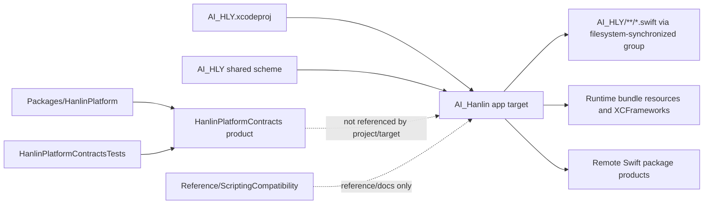
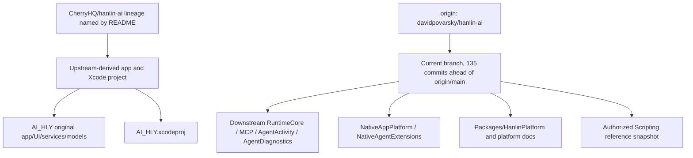
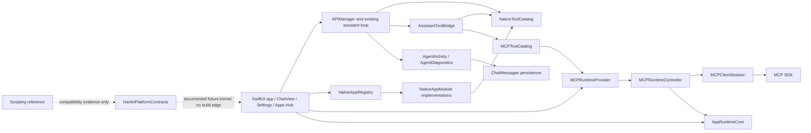
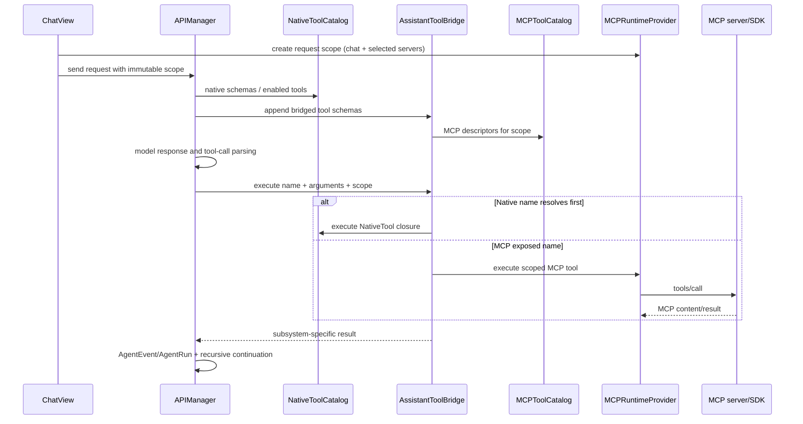
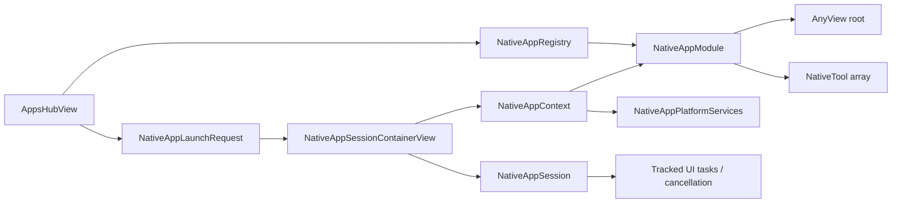
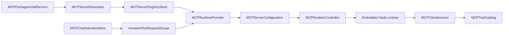
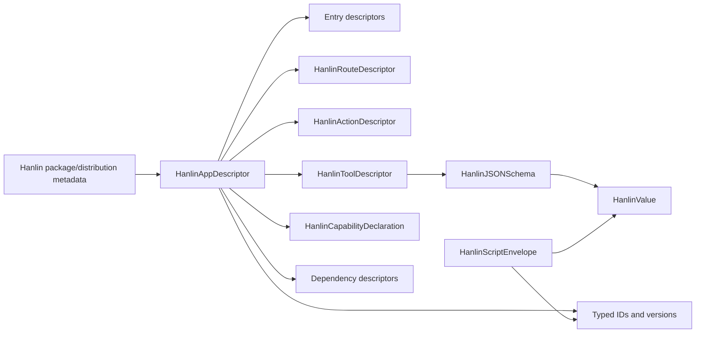
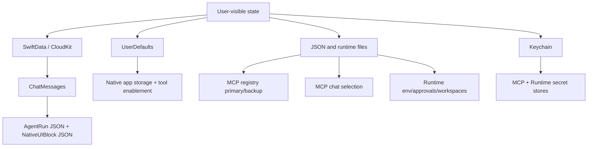
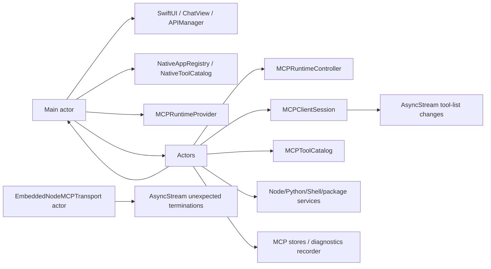

# Hanlin Contract Dependency Map

Snapshot: `codex/fix-mcp-reachable-compatibility` at `da0929110903c83e9314ccd29d14d6d8be987d1a`. This is a static, repository-derived map. Arrows mean a verified build reference, import, construction or call path; dotted arrows mean an intended/documented relationship that is not linked into the app.

## 1. Repository and build graph

Verified build facts:

| Item | Current repository state | Evidence |
| --- | --- | --- |
| Xcode project/target | One app target, `AI_Hanlin`; shared scheme `AI_HLY`; Debug and Release configurations. | C: `AI_HLY.xcodeproj/project.pbxproj:1-790`; `AI_HLY.xcodeproj/xcshareddata/xcschemes/AI_HLY.xcscheme`. |
| Apple platforms | App is iPhone/iPad and sets `IPHONEOS_DEPLOYMENT_TARGET = 26.0`. | C: `AI_HLY.xcodeproj/project.pbxproj:605-684`. |
| Swift mode | App sets `SWIFT_VERSION = 6.0` and approachable concurrency settings. | C: `project.pbxproj:605-684`. |
| Package platform | `HanlinPlatform` uses Swift tools 6.2, Swift language mode 6, iOS 26 and macOS 26; one library product and one test target. | C: `Packages/HanlinPlatform/Package.swift:1-30`. |
| CI Xcode family | Workflows select the newest installed Xcode 26 on `macos-26`; repository status documentation records a previous closure build with Xcode 26.6 / Swift 6.3.3 / SDK 26.5 for commit `2c41b445…`, not current HEAD. | C: `.github/workflows/build-ios26-unsigned-ipa.yml`; D: `docs/hanlin-platform/IMPLEMENTATION_STATUS.md:1-488`. |
| Workflow triggers | IPA workflow is manual **and push-to-main**; dependency update check is scheduled and manual; runtime bundle workflow is manual/reusable. The repository therefore is not globally manual-only today. | C: `.github/workflows/build-ios26-unsigned-ipa.yml:1-16`; `.github/workflows/check-runtime-dependency-updates.yml:1-14`; `.github/workflows/build-runtime-bundle.yml:1-14`. |
| Platform package linkage | No `HanlinPlatform` or `HanlinPlatformContracts` reference exists in the project file or app Swift sources. Only its own tests import the product. | C: `project.pbxproj`; `Packages/HanlinPlatform/Tests/HanlinPlatformContractsTests/HanlinPlatformContractsTests.swift`. |

The app target links the Swift packages recorded in `Package.resolved`, including MCP 0.12.1, SWCompression 4.9.0, swift-log 1.6.2, CoreXLSX, RichTextKit, LaTeXSwiftUI, ZIPFoundation, MarkdownUI, SwiftSoup and LLM, plus the local IOSSystemLite product. JavaScriptCore, NodeMobile and Python runtime artifacts are also connected by the project/build workflow. Exact product references are in `project.pbxproj`; resolved revisions are in `AI_HLY.xcodeproj/project.xcworkspace/xcshareddata/swiftpm/Package.resolved`.

## 2. Source ownership / upstream graph

- H: local Git reports `origin/main...HEAD = 0 left / 135 right`; there is no configured `upstream` remote.
- H: `HanlinPlatform` descriptors were introduced by `5a9a4f3` (2026-07-23); NativeAppPlatform by `4b17b47` and later revisions; MCP by `6f24264` and later revisions.
- D: root `README.md` attributes the base project to `CherryHQ/hanlin-ai`. Because no upstream remote exists, exact upstream branch and per-file divergence cannot be verified from current Git configuration.
- I: existing app/project files are treated as upstream-derived; `Downstream/**`, platform package/docs and Scripting reference are clearly separated downstream additions. This audit changes only a new audit-doc directory and a generic audit script.

## 3. Current logical component graph

Boundary observations:

- `APIManager` remains the orchestration and compatibility choke point. It gathers native and MCP schemas, parses calls, emits agent events, executes through `AssistantToolBridge`, then continues the model/tool loop (C: `AI_HLY/Services/ChatServices/APIManager.swift:2488-4112`).
- `ChatView` creates an immutable MCP request scope per request and owns UI persistence/diagnostics completion (C: `AI_HLY/ChatView.swift:1243-1272`, `1607-1723`).
- `NativeAppRegistry` and `NativeToolCatalog` are `@MainActor` singletons; `MCPToolCatalog` and runtime controllers are actors. The boundary is bridged at request time rather than through one canonical catalog.
- `HanlinPlatformContracts` is structurally independent and package-tested, but currently has no app consumer.

## 4. Tool discovery and invocation graph

Three tool-definition sources coexist:

1. The legacy/native assistant tool list and `NativeToolCatalog` (`NativeTool`, `[String:Any]` schema, executable closures).
2. `MCPToolCatalog` (`MCPToolDescriptor`, arbitrary JSON schema, remote server/session execution).
3. `HanlinToolDescriptor` (typed canonical candidate in an unlinked package).

`AssistantToolBridge` is a routing bridge, not a canonical catalog. Its native-first lookup order is behaviorally significant and must be preserved explicitly if unification occurs.

## 5. App → package → session → runtime graph

### Current native-app path

Current identity chain is mostly `String appID` plus runtime UUIDs. It has no installed package instance, host compatibility negotiation or canonical runtime session object.

### Current MCP package/runtime path

`MCPServerDescriptor` currently spans at least four layers: installed package metadata, durable registry state, user enablement/configuration and cached runtime/tool status. `MCPServerConfiguration` is the narrower runtime boundary and carries resolved absolute paths/environment. A future installed-package contract should separate those concerns instead of promoting `MCPServerDescriptor` wholesale.

### Platform package's intended graph (not live)

Missing edges are as important as existing nodes: catalog → installed instance → launch request → app session → runtime session → service/permission broker → execution/activity are not modeled end to end.

## 6. Persistence and migration graph

| Persistent state | Storage | Schema/recovery | Contract risk | Evidence |
| --- | --- | --- | --- | --- |
| Core conversations/models | SwiftData `ModelContainer`, CloudKit automatic | Model schema is implicit in Swift types; repository audit found no common platform persistence envelope. | High coupling: `ChatMessages` contains many tool-specific JSON/result fields. | C: `AI_HLY/AI_HLY.swift:35-57`; `AI_HLY/Model/ChatMessages.swift:102-263`. |
| Agent run/activity | JSON encoded into `ChatMessages.agentRunJSON` | `AgentRun.currentSchemaVersion = 4`. | UI/product transcript contract is embedded in chat persistence. | C: `AgentActivityModels.swift:185-264`; `AI_HLY/Downstream/AgentActivity/AgentActivityPersistence.swift:1-27`. |
| Native app scoped values | UserDefaults namespaces `nativeapp.<appID>.persistent/cache` | No common schema, quota, migration or backup. Built-ins also own ad-hoc JSON records. | App ID changes or schema drift can orphan data. | C: `NativeAppStorageBroker.swift:3-36`; built-in stores under `NativeAppPlatform/BuiltinApps/**/Persistence`. |
| Native tool enablement | UserDefaults | Catalog-specific migration logic. | Tied to native catalog naming/aliases. | C: `NativeToolCatalog.swift:264-322`. |
| MCP registry/install state | JSON primary + backup, actor-owned atomic verified writes | Schema 1; reads legacy direct-array schema 0; corruption recovery/repair. | Must remain until installed-package migration and user-data policy are approved. | C: `MCPServerRegistryStore.swift:3-185`. |
| MCP chat selection | JSON file or temporary memory | No explicit schema version or backup. | Chat UUID/server UUID linkage and disappearance behavior are local policy. | C: `MCPChatSelectionStore.swift:3-58`. |
| Secrets | Separate MCP and Runtime Keychain actors | Subsystem-specific key/service naming. | No common capability/access/audit semantics. | C: `MCPSecretStore.swift:4-49`; `RuntimeEnvironment.swift:46-90`. |
| Runtime environment/approvals | JSON/file records plus Keychain for secrets | Implementation-specific records and integrity hashes. | Not a general platform permission system. | C: `RuntimeEnvironment.swift:92-165`; `LifecycleExecutionBroker.swift:4-167`. |
| Runtime filesystem | App Support `HanlinRuntime/v1` packages, clients, cache, registry, workspaces | Layout version is embedded in directory name; backup exclusions cover reproducible runtime/package areas. | Absolute URLs must not enter portable domain manifests. | C: `RuntimeFileLayout.swift:3-117`; `MCPFileLayout.swift:3-56`. |
| Agent diagnostics | JSON/text files | Diagnostic-session local formatting/redaction. | Not a stable audit-event protocol. | C: `AgentDiagnosticsRecorder.swift`; `AgentDiagnosticsRedactor.swift`. |

Persistence dependency flow:

There is no common persistence ownership table enforced in code. A future platform layer must declare which records are durable user data, reproducible cache, install state, secrets and diagnostics before it changes backup or migration behavior.

## 7. Concurrency and isolation map

Static lexical totals across 305 Swift files:

- 24 actor declarations.
- 96 lines containing `@MainActor`.
- 9 `AsyncStream` occurrences.
- 4 `@unchecked Sendable` occurrences.
- 4 `Task.detached` occurrences.

These are occurrence counts, not compiler diagnostics.

Contract consequences:

- Platform value/descriptor/wire types are Sendable value types, but are not used at live actor boundaries.
- Native executable/UI protocols are deliberately main-actor bound and carry `AnyView`, closures and `[String:Any]`; they should remain adapter-side implementation types.
- MCP and runtime actors pass subsystem models. Any canonical invocation/session contract must be Sendable and must define cancellation, streaming order and actor ownership.
- Existing unstructured tasks are sometimes session-tracked or lifecycle-slot-owned, but a single cross-runtime cancellation contract is absent. This audit does not classify individual tasks as bugs without compiler/runtime evidence.

## 8. UI and navigation boundaries

| Surface | Entry | Contract boundary |
| --- | --- | --- |
| Main app | `AI_HLY.swift` → main tab/navigation | SwiftUI app owns `ModelContainer`, lifecycle bridge and environment. |
| Chat | `ChatView` + `APIManager` | Central model/tool orchestration, activity persistence and MCP request scoping. |
| Apps Hub | `MainTabView` → `AppsHubView` | Reads `NativeAppRegistry`, creates launch/session containers. |
| Built-in native app | `NativeAppSessionContainerView` | Injects `NativeAppSession` and `NativeAppContext`; module returns `AnyView`. |
| Settings/runtime | `SettingsView` | Links MCP server management and Runtime Center. |
| Mini-app window | secondary `WindowGroup` in `AI_HLY.swift` | Separate presentation route still uses native app runtime models. |

`HanlinRouteDescriptor` and `HanlinActionDescriptor` cannot replace the current navigation/action values directly: descriptors are catalog metadata, while runtime routes/actions are concrete requests and hold UI-specific payload/presentation behavior.

## 9. Scripting reference relationship

The authorized Scripting snapshot is a **reference surface**, not linked product code:

- Baseline ID `scripting-compat-2026-07-22-8d7d33d9369e`, SHA-256 `8d7d33d9369e…`, 999 files and 5,918,732 bytes (D/C: `Reference/ScriptingCompatibility/BASELINE.json`; `README.md`).
- Five declaration files yield 2,419 lexical symbols in the generated inventory. The largest are `global.d.ts` (1,252) and `scripting.d.ts` (804).
- `ScriptingApi` lists calendar, reminders, alarms, contacts, location, HomeKit, photos, health, clipboard and file-system domains; `Script.env` names app, widget, intents, notification, assistant-tool and other contexts (C: `Reference/ScriptingCompatibility/Original/Types/scripting.d.ts:11339-11670`).
- All generated compatibility records remain planned / `implementedByHanlin: false`; declaration presence is not runtime support (C: generated compatibility inventory).
- Reference metadata records Scripting compiler 7.0.2 while the embedded Hanlin runtime lock uses TypeScript 6.0.3. That mismatch requires an explicit compiler compatibility policy; it is not proof that reference scripts compile or run.

## 10. Most important dependency choke points

1. `APIManager` couples model-provider flow, legacy tools, bridged MCP tools, events and recursive continuation.
2. `AssistantToolBridge` encodes native-first resolution and joins two catalogs without a canonical identity namespace.
3. `NativeAppRegistry` binds manifest metadata directly to executable module instances.
4. `NativeAppContext` / `NativeAppPlatformServices` are the concrete service-locator boundary for built-in apps.
5. `MCPRuntimeProvider` is the main-actor bridge from UI/request scopes into actor-isolated registry/runtime/catalog services.
6. `MCPServerDescriptor` combines install, preference, compatibility, path and cached runtime concerns.
7. `AppRuntimeCore.shared` is the process-wide embedded-runtime composition root.
8. `ChatMessages` is a persistence convergence point for chat, tool UI and activity JSON.
9. `RuntimeFileLayout` and `MCPFileLayout` define concrete install/workspace/backup behavior that must stay outside portable manifests.
10. The package boundary is currently one-way isolation: clean contracts exist, but there is no application link or adapter edge.

These choke points determine where narrow adapters can later be introduced with minimal upstream-file edits. No such adapter is implemented by this audit.
