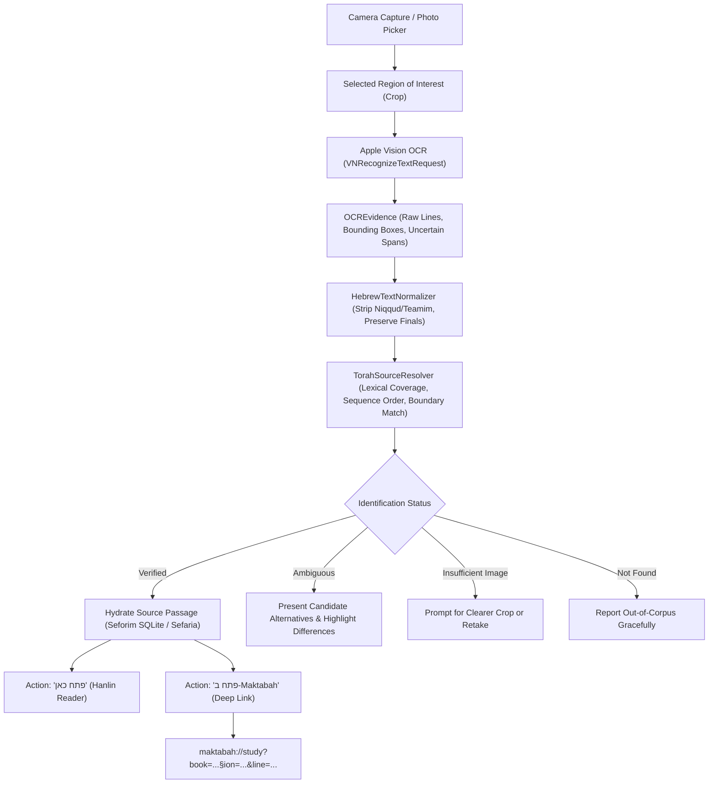

# Torah Photo Study — System Architecture

**Authoritative Core:** `Packages/TorahLibraryKit`  
**Host Applications:** Hanlin (`AI_HLY`) and Maktabah (`Maktabah-iOS`)  
**Shared App Group Container:** `group.com.davidpovarsky.itorah`  

---

## 1. Domain Separation of Responsibilities

| Responsibility | Owning Component | What It Holds | What It Must NEVER Do |
|---|---|---|---|
| **Capture & OCR Evidence** | `TorahOCRService`, `VNRecognizeTextRequest` | Raw image bytes, region bounding box (`OCRRegion`), detected text lines, raw transcription with unvocalized scalar offsets, character uncertainty spans | Never guess or hallucinate a book title or locator from model memory |
| **Passage Resolver & Text Matcher** | `TorahSourceResolver`, `TorahTextAlignment`, `HebrewTextNormalizer` | Candidate score components (`lexicalCoverage`, `sequenceOrderScore`, `boundaryMatchScore`, `anchorUniqueness`), candidate ranking, role detection (`primaryWork`, `citedWork`, `liturgicalCommon`) | Never label a semantic match as `verified` without exact textual lexical alignment; never fabricate a printed page number from an internal database line |
| **Library & Reader** | `ITorahSharedStorage`, `SefariaLibraryProvider`, `BackendCoordinator` | Seforim SQLite database (`seforim.db`), Tantivy/Zayit indexes, text units, commentaries, reader navigation state | Never swap the global active UI reader backend due to a background search request |
| **Agent & Skills** | `NativeToolCatalog`, `ExecuteSkillResourceTool`, `MCPRuntimeController` | Tool exposure planning, execution sandbox, multi-provider enrichment (Sefaria, Yochai, Cairo Genizah) | Never bypass user permissions, invent imaginary tools, or masquerade offline mock data as live execution |

---

## 2. End-to-End Pipeline & Data Flow

---

## 3. Shared Storage (`group.com.davidpovarsky.itorah`)

The App Group shared container allows Hanlin and Maktabah to access the same local Torah catalog without duplicating gigabytes of book assets:
- `seforim.db`: SQLite database indexing all Otzaria seforim.
- `Otzaria/`: Seforim text repository organized by category.
- `manifest.json`: Atomic library generation and checksum descriptor.
- Path resolution handled cleanly by `ITorahSharedStorage.resolveLibraryRoot()`.

---

## 4. Skills & Script Runtime Architecture

Hanlin provides a sandboxed runtime for skill scripts:
- Native tool `execute_skill_resource`:
  - Validates sandbox paths and forbids path traversal (`..`).
  - Dispatches to `AgentHostServicesAdapter.executeRuntime` with engine modes:
    - `.localPython`: Embedded CPython / PythonKit on iOS.
    - `.quickJS`: Embedded JavaScript engine.
    - `.typeScript`: QuickJS with transpilation.
  - Injects isolated environment variables (such as `CAIRO_GENIZAH_STATE_DIR`) into working directory.

---

## 5. Remote Model Context Protocol (MCP)

- Pinned Swift MCP SDK (`0.12.1`) includes native `HTTPClientTransport`.
- Remote server descriptors (`ServerKind.remoteHTTP`) bypass embedded Node.js process spawning and establish direct HTTP/SSE client sessions.
- Dedicated Yochai Knowledge Graph preset:
  - Configures endpoint `https://api.yochai.org/mcp/v1`.
  - Injects `Bearer <API_KEY>` authorization headers.
  - Masks secret tokens from export manifests and agent logs.
